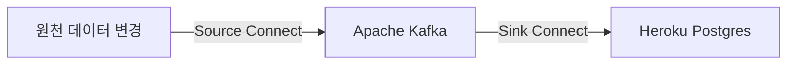
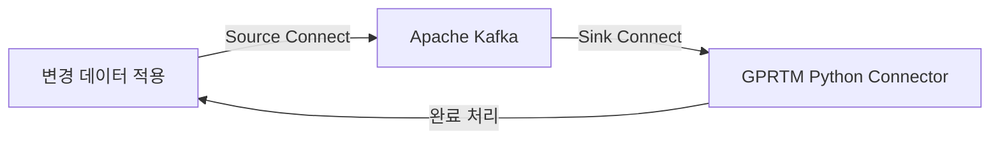

# CDC, Heroku Kafka를 이용한 실시간 고객 통합 솔루션

## 개발개요
* 필자가 속한 회사의 파트너사 솔루션인 Salesforce CDP(현, Data Cloud)를 사용하여 대상 C&C, GS건설의 고객 통합 솔루션을 구축하였었는데, 문제점이 한 두가지가 이니었음
    * 첫 번째로는 고객 통합이 하루 전 데이터 스트림을 기준으로 실행된다는 것(일배치)
    * 두 번째로는 통합된 고객이 많아지게 된다면 일배치이기 때문에 메모리가 뻗어버려 통합이 되지 않는다는 것
        * GS건설 운영 및 유지보수 시기에 고객사 측에서 회원의 수를 100만에서 300만으로 늘리는 요구가 들어왔음
        * 늘렸더니, IR(Identity Resolution = 고객 통합 단계)이 늦게 끝나거나 아예 성공을 못하는 경우가 태반이었음
            * Salesforce 측에서 내놓은 답변은 통합되는 고객 수가 너무 많다는 것...
            * 통합 Rule을 조정하여 통합이 덜 되게끔 하라는 것
        * 게다가, IR이 늦게 성공하여도 문제가 되는 것은 대부분 고객사 측 업무 요건은 데이터 마트를 구축하여 시각적인 당일 데이터 흐름까지 보는 것임, 하지만 고객 통합이 되질 않아서 당일 데이터 마트를 구축하지 못함
    * 세 번째로는 인터페이스 과정에서 고려해야할 점이 많다는 것
        * 원천 - 중개 서버(데이터 가공용) - CDP 데이터 스트림 - CDP 데이터 모델링 - CDP IR 및 CI - CDP Segmentation - MCP - ... 
* XI-SND 프로젝트에서는 Salesforce CDP 없이 고객 통합을 해달라는 업무 요건이 제시 됨
    * 일배치 통합으로는 Salesforce CDP에서 직면한 문제를 마주할 것이 분명하기 때문에, 실시간 통합으로 방향을 돌리기로 함
    * 실시간으로 원천에 있는 데이터의 변경 사항을 알아내야 하는데, CDC(Change Datat Capture)라는 것을 발견함
    * 또한, Heroku Kafka 를 이용하여 실시간 메시지 스트리밍을 구현할 수 있어 이 둘을 적절하게 사용한다면 좋은 솔루션이 될 수 있겠다 생각함

## 개발기간
20230821 ~ 20231031(예상 기간)

## 아키텍쳐

## Flowchart

## KAFKA Source Connect 구축 링크(MySQL)
https://goldenplanet-cdp.notion.site/CDC-MySQL-Source-Connect-7253993fb1a44d72be8aba5bcafaeeb0

## CDC - Kafka - Unify 흐름 설명
### Legacy -> Data Hub

### GPRTM 프로세스 트리거
동기화된 lv0 레코드 하나당 하나의 프로세스로 진행됨 
lv0 -> lv1 -> lv1_external -> union -> link -> unify -> lv2의 과정을 거친 후 완료

## 개발 단계 용어
* L0 : 원천(CDC가 적용 된)과 동일한 레벨의 테이블들
    * L0_DI : Xi S&D 분양관리 원천 레벨의 스키마
    * L0_OM : Xi S&D 옵션관리 원천 레벨의 스키마
    * L0-CX : Service Cloud 레벨의 스키마
* L1 : L0 에서 주소 정제, 컬럼 정제, 데이터 정제가 된 레벨의 테이블들
* Union : L1레벨의 데이터들을 합친 테이블
* Link : Union 에서 정해진 통합 키들을 비교하여 각 고유한 id를 갖고 있는 레벨의 테이블
* Unify : Link의 id들끼리 Group 지어 Reconciliation Rule에 의해 각 컬럼들에서 어떠한 데이터가 표출 되어져야 하는지 결정되어진 레벨의 테이블
* L2 : Salesforce Service Cloud 로의 이관을 위한 Unify 테이블의 인터페이스 레벨 테이블
* HC : Salesforce Service Cloud 레벨 테이블

## 테이블 정의서 및 관계도
(예정)

