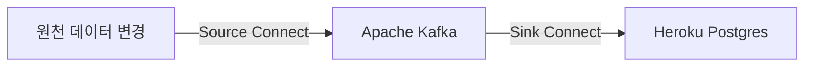
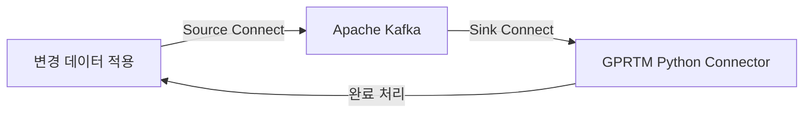

# CDC, Heroku Kafka를 이용한 실시간 고객 통합 솔루션

## 개발개요
* 필자가 속한 회사의 파트너사 솔루션인 Salesforce CDP(현, Data Cloud)를 사용하여 대상 C&C, GS건설의 고객 통합 솔루션을 구축하였었는데, 문제점이 한 두가지가 이니었음
    * 첫 번째로는 고객 통합이 하루 전 데이터 스트림을 기준으로 실행된다는 것(일배치)
    * 두 번째로는 통합된 고객이 많아지게 된다면 일배치이기 때문에 메모리가 뻗어버려 통합이 되지 않는다는 것
        * GS건설 운영 및 유지보수 시기에 고객사 측에서 회원의 수를 100만에서 300만으로 늘리는 요구가 들어왔음
        * 늘렸더니, IR(Identity Resolution = 고객 통합 단계)이 늦게 끝나거나 아예 성공을 못하는 경우가 태반이었음
            * Salesforce 측에서 내놓은 답변은 통합되는 고객 수가 너무 많다는 것...
            * 통합 Rule을 조정하여 통합이 덜 되게끔 하라는 것
        * 게다가, IR이 늦게 성공하여도 문제가 되는 것은 대부분 고객사 측 업무 요건은 데이터 마트를 구축하여 시각적인 당일 데이터 흐름까지 보는 것임, 하지만 고객 통합이 되질 않아서 당일 데이터 마트를 구축하지 못함
    * 세 번째로는 인터페이스 과정에서 고려해야할 점이 많다는 것
        * 원천 - 중개 서버(데이터 가공용) - CDP 데이터 스트림 - CDP 데이터 모델링 - CDP IR 및 CI - CDP Segmentation - MCP - ... 
* XI-SND 프로젝트에서는 Salesforce CDP 없이 고객 통합을 해달라는 업무 요건이 제시 됨
    * 일배치 통합으로는 Salesforce CDP에서 직면한 문제를 마주할 것이 분명하기 때문에, 실시간 통합으로 방향을 돌리기로 함
    * 실시간으로 원천에 있는 데이터의 변경 사항을 알아내야 하는데, CDC(Change Datat Capture)라는 것을 발견함
    * 또한, Heroku Kafka 를 이용하여 실시간 메시지 스트리밍을 구현할 수 있어 이 둘을 적절하게 사용한다면 좋은 솔루션이 될 수 있겠다 생각함

## 개발기간
20230821 ~ 20231031(예상 기간)

## 아키텍쳐


## Flowchart


## CDC - Kafka - Unify 흐름 설명
### Legacy -> Data Hub


### GPRTM 프로세스 트리거
동기화된 lv0 레코드 하나당 하나의 프로세스로 진행됨<br>
lv0 -> lv1 -> lv1_external -> union -> link -> unify -> lv2의 과정을 거친 후 완료


## 개발 단계 용어
* L0 : 원천(CDC가 적용 된)과 동일한 레벨의 테이블들
    * L0_DI : Xi S&D 분양관리 원천 레벨의 스키마
    * L0_OM : Xi S&D 옵션관리 원천 레벨의 스키마
    * L0-CX : Service Cloud 레벨의 스키마
* L1 : L0 에서 주소 정제, 컬럼 정제, 데이터 정제가 된 레벨의 테이블들
* Union : L1레벨의 데이터들을 합친 테이블
* Link : Union 에서 정해진 통합 키들을 비교하여 각 고유한 id를 갖고 있는 레벨의 테이블
* Unify : Link의 id들끼리 Group 지어 Reconciliation Rule에 의해 각 컬럼들에서 어떠한 데이터가 표출 되어져야 하는지 결정되어진 레벨의 테이블
* L2 : Salesforce Service Cloud 로의 이관을 위한 Unify 테이블의 인터페이스 레벨 테이블
* HC : Salesforce Service Cloud 레벨 테이블

## 개발 이슈 및 진척도(주 단위 기준)
* 202308(4) : Task Manager - L0 프로시저(test), L0 - L1(test) 프로시저, L1 - Union 프로시저 완성, CDC test 완료

* 202308(5) : Python Sink Connector 스크립트 세팅 완료, Union - Link 프로시저 완료, Link - Unify 스크립트 세팅 완료

* 202309(1) : L1 - L1_external 스크립트(주소정제) , Unify - L2 프로시저, L2 - HC 프로시저 완료, Link id 생성 시 고려해야 할 점 2가지 확인 완료(체인, 분할)
    * 체인 : 신규 고객 INSERT, UPDATE 시 신규 고객을 기준으로 기존 통합되어진 고객그룹들이 얽혀서 통합되어지는 현상
    * 분할 : 고객 DELETE 시 몇 갈래로 통합 그룹들이 쪼개지는 현상 

* 202309(2) : 분양관리(ORACLE) 원천 시스템 CDC 적용 완료, L0 데이터 수집, L0 - L1 프로시저 생성 완료 , Union - Link 프로시저, Link - Unify 스크립트 예외 케이스 고려 및 재생성 완료, L0 -> Unify 까지 실시간 처리가 늦는 이유로 멀티 쓰레딩 방식 적용
    * 카프카 task manager 토픽에 대한 파티션이 32개로 설정되어있으니 쓰레드를 32개 생성하여 1:1 로 매핑하려는 이론 => 굉장히 빨라졌으나, 메시징 중복 문제 그리고 Insert 시, Unique Key 위배 조건 발생

* 202309(3) : 메시징 중복 문제 해결(멱등성 로직 추가, 수동 커밋 적용)
    * 메시징 중복은 kafka consumer의 default 세팅에 의한 오토커밋, 리밸런싱(토픽 파티션에 대한 메시지를 조정하는 것)에 의해 발생되어졌음.
        * Consumer에 설정된 max_poll_interval_ms 가 default 값으로 300초이고 이 시간내에 Consumer 가 poll() 메서드로 메시지를 불러오지 못할 경우, 리밸런싱 발생
        * 또한, max_poll_records로 poll() 메서드를 호출할 때마다 최대 몇 건의 레코드를 불러오게 하는데, default로 300건임
        * 리밸런싱이 일어날 때, commit을 진행할 수 없다라는 특성을 이용해 오토커밋에서 수동커밋으로 바꾸고 finally하게 consumer.commit()를 호출하게끔 테스트를 해보니 300초가 지날 때, 에러를 내뱉었고, CommitFailedError 가 발생하였음
        * default값으로 설정된 이론에 의하면 최대 300건을 300초안에 처리해야하는데, 우리 솔루션은 한 메시지가 6단계~7단계를 거쳐야하고 union-link 단계는 최대 8초까지 걸리는 것을 보아하니 리밸런싱이 일어나느 것이 당연함
        * max_poll_records 를 적당히 작게(현재, 10) max_poll_interval_ms 를 적당히 크게(현재, 3000000) 로 설정하고 수동 커밋으로 테스트를 해보니 CommitFailedError에러를 내뱉지 않고 리밸런싱을 진행하지도 않았음
        * 아직 완전 해결이라고는 장담할 순 없겠지만 다음 주 1차 통합 테스트 때, 이리저리 데이터들을 넣어봐야겠음

* 202309(4) : 매시징 중복 및 손실 문제 해결
    * 토픽 파티션 리밸런싱이 일어나되, 멱등성 추가 로직(error_retry_cnt)에 의해 더 세밀한 검증
    * poll 단위가 아닌 메시지 별 단위 커밋으로 수정

* 202310(1) : Unify -> L2 -> HC(Service Cloud) 에서 업무 요구사항에 의한 차질 발생
    * 원인은 Unify, HC 이 둘이 바라보는 PK가 다름
        * Unify는 uuid가 pk인데, HC는 uuid가 아닌 sfid 로 Service Cloud 와 DB간의 동기화가 이루어지면 Service Cloud 측에서 자동 생성 됨
        * 또한, HC는 휴대폰 번호와 이메일을 필두로 자동으로 Unique Key 제약조건이 생성 됨
            * 중복되어져서 들어오는 휴대폰 번호와 이메일에 관하여 전 데이터에 전처리가 불가피하게 됨
        * DB 쪽에서 회원이 삭제 되었다고 해도, HC에선 삭제가 이루어지면 안됨..(Service Cloud 측에서 그와 관련된 아파트 정보나 계약 정보가 매핑되어있기 때문에)
        * 업무 요구사항에 다른 채널 회원 데이터들을 통합하여 Service Cloud에 넣는 것과 Service Cloud 에서 생성한 회원 데이터들도 통합하여 다시 Service Cloud 에 넣는 것이 있었기에.. 조금 복잡한 상황
            * 다른 채널(DI, OM) : L0 -> L1 -> Union -> Link -> Unify -> L2 -> HC -> 동기화 -> L0_CX -> L1_CX -> Union -> Link -> Unify -> L2 -> HC
            * CXMS : HC -> 동기화 -> L0_CX -> L1_CX -> Union -> Link -> Unify -> L2 -> HC

* 202310(2~3) : 2차 통합테스트 기간
    * 고객의 주민등록번호나 전화번호등 민감한 정보들이 담겨있는 테이블들은 기본적으로 암호화 되어있어서 원천에서 제공해주는 View 데이터들을 들고와아햐는데, CDC 기술 적용을 맡고있는 매니저님이 View에 적용이 어렵다는 답변을 내놓음.
    * 그래서 테이블에 CDC를 꼽되, Heroku Kafka에서 변경사항 메시지를 받아 어떤 태이블들이 어떤 DML 작업이 일어나는지 확인하고 View 에서 다시 변경 데이터들을 가져와 메시지를 가공하여 L0의 토픽에 다시 push 해주는 작업이 필요했음
        * 이 역할을 해주는 것이 decrypt_sink_connector.py 인데 INSERT, UPDATE 는 문제가 없었으나, DELETE 과정에서 L0 데이터들이 삭제가 안되는 문제 발생
        * 원천에서 CDC를 꼽은 테이블들은 DELETE 시, 변경사항 레코드 뿐만 아니라 후에 툼스톤 레코드(메시지)라는 것이 넘어오는데, 이 메시지에는 key값만 존재하고 value는 없는 상태여서 key 값만 복사하고 producer가 토픽에제 전송하였었음.
        * 삭제가 안되는 원인을 찾다가 원천 CDC의 변경사항 메시지를 받은 KafkaConsumer와 이 메시지를 받고 처리를 하여 다시 L0 CDC가 구독한 토픽에게 전송하는 kafkaProducer 의 툼스톤 메시지를 비교하기로 함
        

        

        토픽 이름, 파티션, 오프셋을 제외한 다른 값들은 변경사항이 있으면 안되는데, 이상하게도 serialized_value_size가 -1 에서 4로 변한 것을 확인함
        ```
        producer = KafkaProducer(
            acks=1,
            compression_type='gzip',
            bootstrap_servers=bootstrap_servers,
            security_protocol='SSL',
            ssl_context=ssl_context,
            # linger_ms=1000,
            value_serializer=lambda x: dumps(x).encode('utf-8') if x is not None else None,
            retries=3
            # value_serializer=None
        )
        ```
        kafkaProducer에서 NULL 을 None으로 변경할 때, utf-8 인코딩 형식으로 변경하여 직렬화된 value size가 4바이트로 변경되었다고 추측함.
        그래서 명시적으로 serialized_value_size 를 -1로 변경하여 다시 DELETE 테스트를 해보니 제대로 삭제 처리가 이루어짐
    * Unify 모델 마케팅 수신 동의 컬럼 로직 변경
        * Unify 모델에는 고객사 컨설팅이나 마케터가 정해준 룰에 따른 통합 로직을 거쳐 통합되어진 고객들의 각 데이터들에 값을 정하는 Reconciliation 과정이 존재함.
        * 현재는 채널별, 빈도별, 날짜별로 3가지 우선순위 규칙이 존재(Salesforce CDP Reconciliation Rule 과 흡사)
        * 날짜별이라 하면, 모든 고객 데이터들을 Union 시킨 Union 테이블의 cust_modify_dt(수정일)컬럼의 오름차순 또는 내림차순으로 결정하는 우선순위 규칙인데, 고객사측에서 마케팅 수신 동의 컬럼 우선순위를 고객 수정일이 아닌 다른 테이블의 데이터를 봐야한다고 함.
            * 그래서 Marketing Customer 테이블을 만들고 unify.py와 sink_connector.py에 따로 마케팅 로직 처리를 추가하였음
    * 기존 예외 처리 과정 시, 세션이 블락된 채 로직을 진행하려하니 세션을 다시 사용하지 못하는 결함 처리 완료
    * 성능 이슈를 보완하기 위해 멀티 쓰레딩 환경에서 통합로직을 거치다 보니, 데이터 일관성에 대한 검증을 하는 시간이 많았음
        * L0 -> L1 : 각 레코드들을 복사하는 과정이니 문제 없음
        * L1 -> Union : 각 레코드들을 Union 하는 과정이니 문제 없음
        * Union -> Link : UPDATE, DELETE 시 통합이 쪼개지는 분할체인 과정에서 고려할 점이 있었음
            * 이러한 과정은 DB 함수인 func_union_to_link_sub() 가 담당하고 있는데, 안을 들여다 보면 통합이 둘 이상으로 쪼개진다면 기존 uuid를 새 uuid들로 UPDATE 하는 쿼리가 있음. 
            * 이 쿼리가 멀티 쓰레딩 과정에서 위험한 게, phantom read가 발생하여 제대로 된 분활이 되지 않을 가능성이 있음
            * 그래서 성능을 조금 떨어뜨리더라도 func_union_to_link() 시작 시, UPDATE나 DELETE 라면 access exclusive lock을 명시적으로 걸어주어 일관성을 확보하는 방안 채택
        * Link -> Unify : uuid 를 전달받아 Link와 Union 테이블들의 조인 레코드들로 로직 진행하기에 문제 없음
        * Unify -> L2 : 각 레코드들을 복사하는 과정이니 문제 없음

* 202310(4) : 컷오프 및 오픈
    * DI(분양관리), OM(옵션관리), CX(Service Cloud) 회원 데이터를 한 번에 부어 오픈할 준비를 하는 과정 진행
    * 데이터 검증 작업은 LG CNS 측에서 담당
    * 실시간에 멀티 쓰레딩 방식으로 트랜잭션을 처리하다보니 생각치도 못한 많은 예외 상황이 발생했었고 많은 고민과 시행착오 끝에 2차 통합테스트도 마무리 잘 지었지만 역시 어떤 변수가 생길지는 모름
    * 역시나 변수가 생김
        * 첫 번째는 union -> link 과정에서 일어나는 프로세스가 데이터가 쌓이면 쌓일수록 느려짐
            * 쿼리 실행계획들을 뜯어보니 func_union_to_link 함수 시작 지점에서 func_return_to_uuid 함수를 호출하는데 이 함수의 시작점인 task_manager와 union_customer를 조인하는 시점에서 심하게 느리다는 것을 발견함
            * task_manager에 인덱스를 걸고, where 절에 조건 하나를 추가하여 검색범위를 좁혀주니 20초 이상 걸리던 쿼리가 5~7초대로 준 것을 확인함
        * 두 번째는 HC -> Salesforce Service Cloud 지점인데, 이 지점은 Heroku Connect 가 동기화를 시키는 지점임
            * Heroku Connect 가 동기화를 순차적으로 몇 초에 몇 십건밖에 동기화를 시키고 있지 못함..
            * 빠른 속도 아니냐 할 수 있는데, 이 프로젝트는 회원 뿐만 아니라 아파트 정보, 계약 정보, 프로젝트 정보 등 총 백 만건이 넘어가는 레코드들이 Service Cloud 에 실시간으로 동기화가 되어지고 있어서 저 속도로는 컷 오프 마무리 시점까지는 절대 끝내지 못하는 상황임
            * Heroku connect 동기화 방식을 찾아보니 2개의 알고리즘이 존재하는데, Ordered Algorithm 과 Merged Writes Algorithm 으로 현재 기본 값으로 우리가 사용하고 있는 Ordered Algorithm 을 사용하고 있었음
            * Heroku devcenter 문서에서 나온 걸 보니, Ordered Algorithm은 Bulk API를 사용하여 대량 INSERT 작업에 적합하고, Merged Writes Algorithm 은 대량 INSERT 가 아닌 작은 단위 레코드들과 변화가 자주 일어나는 레코드들을 INSERT 하는데 적합함. 여기서 대량이라함은 2000건 이상의 레코드라고 명시되어 있음.
            * Heroku Connect polling(=동기화) 시간은 실시간 업무 요건이다 보니 최소로 줄여 2분으로 설정해놓았음.
            
            * 그럼, 2분안에 2000 건의 이상 레코드가 동기화 큐에 쌓여서 Bulk API가 호출되느냐 라는 질문에 당연히 쌓이지 못한다고 의견을 내놓았고 적은 단위의 레코드들을 처리하는 SOAP API 가 호출된다는 것을 깨달아 Merged Writes Algorithm 으로 변경하였더니, 처리속도가 급격하게 빨라진 것을 확인함.
    * 그렇게 컷오프를 진행하는 과정에서 변수들을 해결하고 성공적으로 오픈 진

* 202311(1) : 모니터링 기간
    * 본래 모니터링 기간은 없었지만 LG CNS 측에서 일주일만 더 있어달라는 부탁에 일주일 더 상주하면서 모니터링 기간을 갖게 됨
    * Chain 로직 함수 수정
        * (예정)
    * LG CNS PM 을 맡으신 책임님께서 우리 팀의 프로젝트를 흥미롭게 여기시고는 본인의 개발 팀 내부 프로젝트로 진행하고 싶다고 소스와 관련 자료들을 요청..